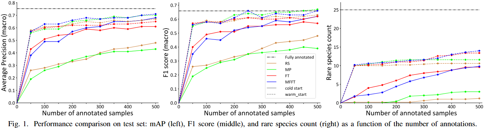
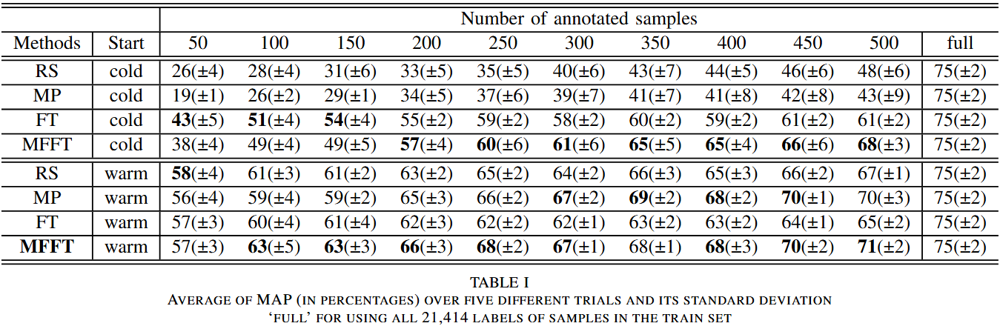

# Hybrid Disagreement-Diversity Active Learning for Bioacoustic Sound Event Detection
---
This repo contains code for our paper: **Hybrid Disagreement-Diversity Active Learning for Bioacoustic Sound Event Detection** in EUSIPCO 2025. It introduces mismatchness-first farthest traversal (MFFT) active learning strategy, which can significantly reduce the number of annotations required for training a classifier in Bioacoustic Sound Event Detection (BioSED) tasks. MFFT uses only 2.3% of the total annotations to achieve mAP performance (68% in cold-start, 71% in warm-start) comparable to fully supervised methods (75%). The results demonstrate MFFT's effeciency in saving labeling budget and the ability to detect rare species events (according to the right sub-figure in the section of `Our results`).

This repo builds a dataset specifically designed for Active Learning (AL) in the field of Bioacoustic Sound Event Detection (BioSED) (based on DCASE 2024 Task 5).

This repo provides the code for training and evaluation scripts for 4 different sampling strategies `random sampling`, `farthest traversal`, `mismatchness priority` and `mismatchness-first farthest traversal` in both `cold` and `warm` start senarios, as well as the code for supervised training and evaluation of the encoder.

## Structure
---
The repo is structured as follows:
```
Project_root
├── assets
│   └── <some_images>.png
├── configs
│   ├── config.yaml
│   ├── SL (will be automatically generated during supervised training phase)
|   |   ├── train
│   |   |   └── <audio_files>.wav
│   |   ├── valid
│   |   |   └── <audio_files>.wav
│   |   ├── train_label.csv
│   |   ├── valid_label.csv
|   |   └── mean_std.pkl
│   ├── AL (will be automatically generated during active learning phase)
|   |   ├── train
│   |   |   └── <audio_files>.wav
│   |   ├── valid
│   |   |   └── <audio_files>.wav
│   |   ├── test
│   |   |   └── <audio_files>.wav
│   |   ├── train_label.csv
│   |   ├── valid_label.csv
│   |   ├── test_label.csv
│   |   ├── train_set.h5
│   |   ├── valid_set.h5
│   |   ├── test_set.h5
│   |   └── mean_std.pkl
├── logs (will be automatically generated)
│   └── ...
|── models (will be automatically generated)
│   └── ...
├── scripts
│   ├── sl_train.py
│   ├── sl_eval.py
│   ├── al_train.py
│   ├── al_train_full.py
│   └── al_eval.py
├── src
│   ├── al
│   |   ├── __init__.py
│   |   ├── train.py
│   |   └── eval.py
│   ├── sl
│   |   ├── __init__.py
│   |   ├── train.py
│   |   └── eval.py
│   ├── torchlibrosa (from https://github.com/qiuqiangkong/torchlibrosa)
│   |   ├── __init__.py
│   |   ├── augmentation.py
│   |   └── stft.py
│   ├── data.py
│   ├── models.py
│   ├── prep.py
│   └── utils.py
├── results (will be automatically generated by the evaluation scripts)
│   └── al_results.csv
├── requirements.txt
├── LICENSE
└── README.md
```

## Our results
---

The following curve plots show the performance of all the active learning strategies on the AL test set.


The following table shows our results of all the active learning strategies on the AL test set.


## Device requirements
---
100 or more GB of free disk space is recommended to run the code, and a GPU with at least 12 GB of memory is recommended for training (active learning phase only, if you want to train the encoder yourself, please use 48 GB GPU memory or reduce the batch size for encoder training). The code has been tested on NVIDIA A100 GPUs.

## Environment setup
---
We strongly recommend using the Anaconda environment to run the code. The following command can be used to create the environment:

```bash
# Create a new conda environment named 'bioac' with Python 3.12
conda create -n bioac python=3.12
# Activate the newly created environment
conda activate bioac

# Option 1: Install the required packages from the requirements.txt file
# Some packages like torch, torchvision, and torchaudio may need to be installed from a specific index URL for compatibility with CUDA.
pip install -r requirements.txt

# Option 2: Install the required packages individually using the following commands
pip install torch==2.5.1 torchvision==0.20.1 torchaudio==2.5.1 --index-url https://download.pytorch.org/whl/cu124
pip install h5py
pip install omegaconf
pip install pandas
pip install torchmetrics
pip install librosa
pip install matplotlib
```
## Source dataset download
---

If you want to automatically download the source dataset during training, please make sure you can use:
- `wget` on Linux
- `curl` on MacOS or Windows

Sometimes due to network issues, the automatic download may fail, in that case, you can manually download the source dataset as described below.
If you want to manually download the source dataset, please download it in the following [link](https://zenodo.org/api/records/10829604/files-archive), put it in the `/project_root/data` folder. Please make sure the name of the zip file is `source.zip`, if not, please rename it to `source.zip`.

## Usage (evaluate our results)
---
### I. Download the pre-trained encoder weights
If you want to infer the results of our paper, you can directly download all the models we trained from [this link](https://zenodo.org/xxx) unzip them all and put them in the `/project_root/models` folder. The structure of the `/project_root/models` folder should be like this:
```
Project_root
├── ... (other folders)
|── models
|   ├── pretrained
|   |   ├── classifier.pth
|   |   ├── Cnn14_DecisionLevelMax_mAP=0.385.pth
|   |   └── encoder.pth
|   ├── sl
|   |   ├── best_classifier.pth
|   |   └── best_encoder.pth
|   ├── al_train
|   |   ├── exp_1
|   |   |   ├── rand_with_0_pos_init
|   |   |   |   ├── 50.pth
|   |   |   |   ├── 100.pth
|   |   |   |   ├── 150.pth
|   |   |   |   ├── 200.pth
|   |   |   |   ├── 250.pth
|   |   |   |   ├── 300.pth
|   |   |   |   ├── 350.pth
|   |   |   |   ├── 400.pth
|   |   |   |   ├── 450.pth
|   |   |   |   └── 500.pth
|   |   |   ├── rand_with_5_pos_init (same as rand_with_0_pos_init)
|   |   |   ├── ft_with_0_pos_init (same as rand_with_0_pos_init)
|   |   |   ├── ft_with_5_pos_init (same as rand_with_0_pos_init)
|   |   |   ├── mp_with_0_pos_init (same as rand_with_0_pos_init)
|   |   |   ├── mp_with_5_pos_init (same as rand_with_0_pos_init)
|   |   |   ├── mfft_with_0_pos_init (same as rand_with_0_pos_init)
|   |   |   └── mfft_with_5_pos_init (same as rand_with_0_pos_init)
|   |   ├── exp_2 (same as exp_1)
|   |   ├── exp_3 (same as exp_1)
|   |   ├── exp_4 (same as exp_1)
|   |   └── exp_5 (same as exp_1)
|   └── al_train_full
|       ├── exp_1.pth
|       ├── exp_2.pth
|       ├── exp_3.pth
|       ├── exp_4.pth
|       └── exp_5.pth
├── ... (other folders)
```
### II. Run the evaluation script
You can run the evaluation script to get the results of all the active learning strategies. This will generate a csv file `al_results.csv` in the `/project_root/results` folder, which contains the evaluation results of all the active learning strategies on the AL test set as well as the detected rare species events in the AL train set.

```bash
conda activate bioac
cd /<project_root>/scripts
python al_eval.py
```

## Usage (strat from scratch)
---
### I. Train and evaluate the encoder (Optional)
---
#### a. If you want to train the encoder yourself:
In this step, you will supervisedly train the encoder using the Supervised Learning (SL) dataset. 
You will get a trained encoder that will be used in the next step for active learning to extract fixed features from the audio files.

Only the encoder with the best performance on the SL valid set will be saved and then used in the active learning phase.

```bash
conda activate bioac
cd /<project_root>/scripts
python sl_train.py
# After training, you can evaluate the encoder on the SL valid set
python sl_eval.py
```

#### b. If you don't want to train the encoder yourself:
Sometimes, if you want to reproduce our results as close as possible (The training process always includes some randomness, so the results may not be exactly the same), or simply want to complete the Active Learning process yourself, you can directly ignore this step and use the pre-trained encoder weights we provide. Please download `best_encoder.pth` from [this link](https://zenodo.xxx) and move it to `/project_root/models/sl/best_encoder.pth`.

### II. Active Learning
---
In this step, you will iteratively train the classifier using the Active Learning (AL) dataset.
Classifier is trained on the top of the frozen encoder to make the comparison fair for different active learning strategies.

The command below will sweep all the following combinations of parameters:
Active learning strategies include `random sampling`, `farthest traversal`, `mismatchness priority` and `mismatchness-first farthest traversal` which are defined from `al.trainer.select_mode` in `/project_root/configs/config.yaml`.

Cold & warm start senarios are defined from `al.trainer.init_pos_num_per_class` in `/project_root/configs/config.yaml`, `0` means cold start and `any positive integer` means warm start, you can change it by yourself, the default warm start `init_pos_num_per_class` is `5`.

The number of selected samples in active learning iterations is defined from `al.trainer.num_anno_samples_list` in `/project_root/configs/config.yaml`, the default value is `[50, 100, 150, 200, 250, 300, 350, 400, 450, 500]`. You can change it to any positive integer list you want, but make sure the last value is less than or equal to the total number of samples `21414` in the AL dataset.

**The following command will sweep all the combinations of the above parameters and run the active learning process.**

```bash
conda activate bioac
cd /<project_root>/scripts
# Run the active learning training script with the specified experiment ID (integer)
# This script will automatically run the experiment for 5 times with the exp_id 1~5.
# If you don't want to run the experiment for multiple times, you can change the `exp_ids` list in this script to `[1]` or any other integer you want.
python al_train.py
```

### III. Fully annotated dataset training for the classifier
---
In this step, you will train the classifier using the fully annotated AL dataset.

```bash
conda activate bioac
cd /<project_root>/scripts
# This script will automatically run the experiment for 5 times with the exp_id 1~5.
# If you don't want to run the experiment for multiple times, you can change the `exp_ids` list in this script to `[1]` or any other integer you want.
python al_train_full.py
```
If your training process got interrupted coincidentally, you can resume the training by running the same command again. The script will automatically detect the last sub step and continue from there.

### IV. Evaluate all AL strategies
---

In this step, the script will generate a csv file `al_results.csv` in the `/project_root/results` folder, which contains the evaluation results of all the active learning strategies on the AL test set as well as the detected rare species events in the AL train set.

```bash
conda activate bioac
cd /<project_root>/scripts
python al_eval.py
```

## Citation
If you find this code useful, please cite our paper:
```bibtex
@inproceedings{zhang2025activelearning,
  title={Hybrid Disagreement-Diversity Active Learning for Bioacoustic Sound Event Detection},
  author={Zhang, Shiqi and Virtanen, Tuomas},
  booktitle={2025 33rd European Signal Processing Conference (EUSIPCO)},
  year={2025},
  organization={IEEE}
}
```

## References & Acknowledgements
---
The idea of applying the mismatchness-first farthest traversal active learning strategy to BioSED field is inspired by the work of [zhao-shuyang/active_learning](https://github.com/zhao-shuyang/active_learning).

The mel spectrogram generating code is from the work of [qiuqiangkong/torchlibrosa](https://github.com/qiuqiangkong/torchlibrosa).

The encoder structure and pre-trained weights are from the work of [qiuqiangkong/audio_tagging_cnn](https://github.com/qiuqiangkong/audioset_tagging_cnn).

The dataset used in this repo is from the DCASE 2024 Task 5: Bioacoustic Sound Event Detection, which is available at DCASE 2024 Task 5 [(challenge homepage)](https://dcase.community/challenge2024/task-few-shot-bioacoustic-event-detection) [(dataset)](https://zenodo.org/records/10829604).

We are really grateful for their work, which has greatly facilitated our research.

If you use the code, please consider citing their work as well:

```bibtex
@article{shuyang2020active,
  title={Active learning for sound event detection},
  author={Shuyang, Zhao and Heittola, Toni and Virtanen, Tuomas},
  journal={IEEE/ACM Transactions on Audio, Speech, and Language Processing},
  volume={28},
  pages={2895--2905},
  year={2020},
  publisher={IEEE}
}
@article{kong2020panns,
  title={Panns: Large-scale pretrained audio neural networks for audio pattern recognition},
  author={Kong, Qiuqiang and Cao, Yin and Iqbal, Turab and Wang, Yuxuan and Wang, Wenwu and Plumbley, Mark D},
  journal={IEEE/ACM Transactions on Audio, Speech, and Language Processing},
  volume={28},
  pages={2880--2894},
  year={2020},
  publisher={IEEE}
}
@article{morfi2021few,
  title={Few-shot bioacoustic event detection: A new task at the dcase 2021 challenge},
  author={Morfi, Veronica and Nolasco, In{\^e}s and Lostanlen, Vincent and Singh, Shubhr and Strandburg-Peshkin, Ariana and Gill, Lisa and Pamula, Hanna and Benvent, David and Stowell, Dan},
  year={2021}
}
@article{nolasco2022few,
  title={Few-shot bioacoustic event detection at the dcase 2022 challenge},
  author={Nolasco, Ines and Singh, Shubhr and Vidana-Villa, E and Grout, Emily and Morford, J and Emmerson, M and Jensens, F and Whitehead, Helen and Kiskin, Ivan and Strandburg-Peshkin, Ariana and others},
  journal={arXiv preprint arXiv:2207.07911},
  year={2022}
}
@misc{liang2024mind,
    author = "Liang, Jinhua and Nolasco, Ines and Ghani, Burooj and Phan, Huy and Benetos, Emmanouil and Stowell, Dan",
    title = "{Mind the Domain Gap: a Systematic Analysis on Bioacoustic Sound Event Detection}",
    year = "2024",
    journal = "arXiv preprint arXiv:2403.18638",
    url = "https://arxiv.org/abs/2403.18638",
    eprint = "2403.18638",
    archiveprefix = "arXiv",
    primaryclass = "cs.SD"
}
```

## License
---
This project is licensed under the [MIT License](LICENSE). You are free to use, modify, and distribute the code, but please provide appropriate credit to the original authors and include the license in your distribution.

## Contact
---
If you have any questions or suggestions, please feel free to leave an issue or contact me via email at `tiosisai@gmail.com`.